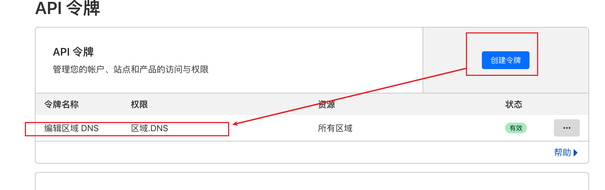

## 什么是 acme.sh 

`acme.sh` 是一个用于从 Let's Encrypt 获取 SSL 证书的 UNIX shell 脚本。它实现了 Automated Certificate Management Environment (ACME) 协议。

Let's Encrypt 是一个提供免费 SSL/TLS 证书的非盈利证书颁发机构。这些证书可以用来加密网站的通信并验证其身份。

`acme.sh` 的特点包括：

1. 完全依赖于 Shell 环境：与其他的 ACME 客户端不同，`acme.sh` 不需要安装其他的依赖软件，只要有 Unix shell 环境即可运行，因此它可以在几乎任何 Unix/Linux 系统上运行。

2. 支持多种验证方式：包括 HTTP、DNS 和别名验证。

3. 支持自动续期：`acme.sh` 可以设置为自动检查和续期证书，以避免证书过期。

4. 支持安装证书：`acme.sh` 还提供了一些命令，可以将生成的证书自动安装到某些常见的服务器软件上，例如 Apache 或 Nginx。

要使用 `acme.sh`，你需要在你的服务器上下载和安装它，然后运行适当的命令来请求和安装证书。

## 安装 acme.sh

官网：https://github.com/acmesh-official/acme.sh

```bash
curl https://get.acme.sh | sh -s email=my@example.com
```

## 如何使用

以 cloudflare dns 为例

### 需要获取 Cloudflare 令牌

如果无法使用，请使用 Global API Key



### 将令牌及Email 导入环境变量

```bash
export CF_Key="xx"
export CF_Email="xx"
```

### 执行如下命令

#### 使用 Cloudflare DNS 自动验证

它会使用上面的认证信息自动添加 txt 记录到 DNS 解析记录中，还可以**自动续期**

```
acme.sh --issue --dns dns_cf -d your-domain.com  --server letsencrypt
```

#### 使用手动验证方式

这种方式需要手动添加 txt 解析记录，而且**不会自动续期**

```bash
acme.sh --issue -d your_domain_name.com --standalone -k ec-256 --server letsencrypt
```


## 注意事项

1. 免费证书有效期 3 个月
2. 如果执行脚本时出错，可以添加 ```--debug 2``` 参数，它会有详细的错误日志，注意后面有一个 **2**

发现公司挺多人不会使用这个证书，还要花钱买，一开始我挺不理解的，但后面想想，买的证书的有效期可以是一年及以上，可能这就是收费带来的好处吧， 而且更新证书的流程也非常复杂，不太适用使用这种很短有效期的证书。
