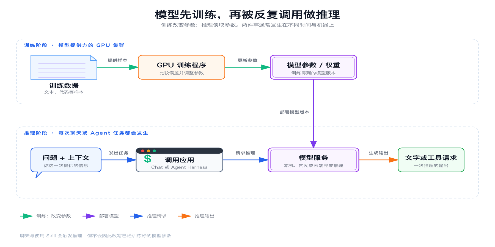

> 系列导读：[Agent 入门｜从会回答，到能完成任务](/posts/agent-basics/)

你先告诉 AI：“表格里红色代表逾期，摘要要先写风险，再写下一步。”几轮之后，它不但不再解释红色是什么意思，还会主动沿用你的格式。看起来，它像是被你“训练”好了。

这个说法不准确。**对话改变的是模型这一次拿到的信息；训练改变的才是模型内部的参数。** 两者都可能让输出发生变化，但发生变化的位置完全不同。

## 模型是什么

可以先把大语言模型理解成一个复杂的预测系统。它接收一段输入，根据内部大量数字之间形成的关系，计算接下来什么输出更合适。这些内部数字通常叫参数。

参数不是一排可以直接翻阅的知识卡片。模型也不是先在脑中找到一篇原文，再把答案复制出来。大量参数共同表示语言、事实和关系中的模式；同一句话放进不同上下文，计算出的后续也会不同。

这解释了为什么模型既能回答熟悉问题，也可能把看起来合理却不存在的内容说得很肯定：它的工作是根据当前输入生成结果，不是自动查验每句话是否已经由现实世界证明。

## 训练是在改变参数

训练时，系统给模型大量样本，让它尝试预测，再根据误差调整参数。这样的过程反复发生，最终得到一个新的参数版本。

这里有一条清楚的边界：如果参数没有因为这次过程而更新，就不能把它叫作模型训练。修改提示词、追加一份文档、保存一条记忆，都会影响后续回答，但它们没有因此改变基础模型的参数。

所以最短的记法是：

> 训练是在调机器；推理是在用机器。

## 推理是在使用参数

训练完成后，把一个具体问题交给模型，让它用现有参数生成回答或动作建议，这个运行阶段叫推理。

“推理”在这里不只指解数学题或长时间思考。哪怕模型只补全一句话，只要是在使用已训练的参数产生输出，也属于推理。模型服务做的核心工作，就是接收输入，运行这次计算，再把输出返回给调用它的应用。

同一个模型在两次推理中给出不同回答，不代表它在两次之间必然重新训练过。输入、上下文、采样方式和可用工具发生变化，都可能改变结果。

## 为什么它在一段对话里越来越懂你

因为聊天应用通常会把当前问题和前面的消息一起整理后，再交给模型。这一包临时材料叫上下文。

第一轮只问“红色是什么意思”，模型几乎没有线索。第十轮时，它同时看见你之前的定义、示例、纠正和刚提出的问题，回答自然更贴近你的要求。改变的是本次推理的输入，不是模型内部的参数。

新开一段对话后，这种“默契”可能消失，也是同一个原因：旧消息没有进入新的上下文。如果应用提供跨会话记忆，通常也是先把信息存到模型之外，需要时再取回并放进上下文。它让信息能跨会话复用，却仍不等于现场训练模型。

## Skill 为什么也不是训练

Skill 保存的是一类任务的说明、知识、步骤或模板。任务相关时，Harness 把 Skill 的内容交给 Agent；模型在这次推理中参考它，决定接下来怎样做。

例如，一个 Skill 可以要求“先核对数据来源，再归纳异常，最后生成待审稿”。它确实改变了 Agent 的工作方式，但改变来自新增的任务说明。拿走这个 Skill，专门做法也就不再可用；基础模型的参数并没有因此多出一块新的能力。

聊天记录、外部记忆、检索资料和 Skill 都可以进入上下文。它们的共同点是：**给同一个模型补充本次任务所需的信息。** 训练则是在更早或单独进行的过程中调整模型本身。把这条线划清，后面理解 Agent 的各个组件就不会混在一起。

还有一个容易混淆的问题：当前聊天没有实时训练模型，不代表聊天数据永远不会被某个平台用于未来训练。那属于产品的数据政策和组织制度，需要看具体条款；它与“这一轮对话是否正在修改参数”不是同一个问题。

以后再听到“AI 学会了”，先问：变的是模型参数，还是它拿到的上下文？只要能回答这一问，“训练、记忆、Skill、聊天”就各自回到了正确的位置。

---

上一篇：[系列导读](/posts/agent-basics/) ｜ 下一篇：[Agent 入门 01｜Chat 和 Agent，差别究竟在哪里](/posts/agent-basics-01-chat-agent/)
