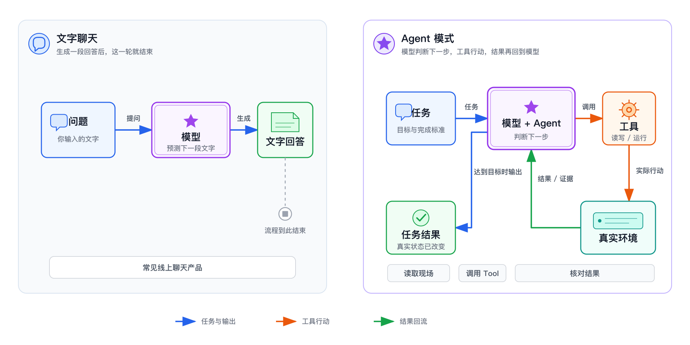
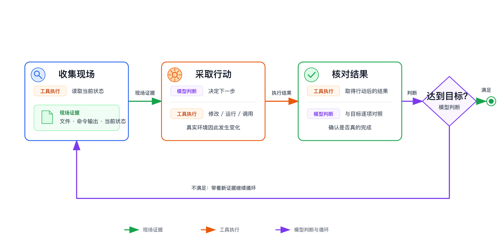

> 系列导读：[Agent 入门｜从会回答，到能完成任务](/posts/agent-basics/)

你对 AI 说：“帮我整理这个目录里的报销材料。”

一种结果是，它给你一套清楚的建议：按月份建文件夹，再按“日期—类型—金额”重命名。另一种结果是，它先读取目录，识别文件，创建分类，移动材料，然后重新检查有没有遗漏。

前一种是在回答怎样做，后一种是在环境里把事情做出来。**Chat 与 Agent 的关键差别，不是有没有聊天框，而是一次回答有没有被扩展成“观察—行动—核对”的循环。**



## Chat 是交互形态，不是能力上限

Chat 的基本结构很简单：人发一条消息，系统返回一条消息。它适合解释概念、改写文字、归纳已经提供的材料，或通过多轮追问逐渐澄清问题。

但聊天界面并不能替一个产品定性。同一个聊天窗口，既可能只生成文字，也可能接入搜索、文件和业务系统。Agent 也常常通过对话和人协作：它汇报进度、请求补充信息，遇到无法判断的地方再停下来问。

因此，不能用“看起来像聊天”判断它是不是 Agent。要看这一轮工作有没有触碰真实现场，并根据现场变化继续推进。

## Agent 先观察，而不是先表演动作

Agent 的第一步通常是取得完成任务所需的上下文。整理目录时，它要先知道有哪些文件；修改网页时，它要先读现有内容和结构；调查一个异常时，它要先取得错误信息和相关记录。

这一步的意义不是让过程显得谨慎，而是让后续判断建立在事实之上。如果 Agent 没看到目录内容，却直接声称“已经分好类”，那只是生成了一段关于行动的文字。

观察也不等于无限收集。它只需要拿到足以决定下一步的信息。问“这份文档的标题是什么”，读到标题就够了；要求“找出相互矛盾的条款”，则必须读取相关段落并建立比较范围。

## 工具把判断变成行动

模型根据上下文决定下一步，Tool 才真正接触外部环境。读文件、写文件、运行命令、查询数据库、打开网页，都属于工具能完成的动作。

这里需要分清一句“做了”和一个事实。模型可以生成“我已经创建清单”，但只有写文件工具返回成功，并且随后能重新读到那份清单，环境才真的发生了变化。

工具结果还会成为新的上下文。搜索没有找到目标，文件格式与预期不同，命令返回错误——这些都不是对话的终点，而是下一步判断的依据。

## 核对让动作成为完成

执行成功不等于目标达成。Agent 还要把结果和完成标准对照：移动文件后重新列目录，修改页面后查看实际显示，生成表格后核对行数与关键字段。

如果结果不符，核对得到的新观察会进入下一轮：



```text
观察现场 -> 采取行动 -> 核对结果
    ^                         |
    +-------------------------+
```

这条循环可能只跑一轮，也可能反复多轮。任务越开放，现场反馈越多，Agent 越需要根据结果调整。反过来，如果问题只需要解释一个概念，最合适的结果可能就是一次回答，没有必要为了显得“像 Agent”而强行调用工具。

## Harness 为什么不可缺

模型不会自己保存完整会话，也不会凭空拥有文件系统。Harness 负责把人的目标、已有消息、工具定义和现场结果组织起来：把当前上下文送给模型，接住模型选择的动作，调用工具，再把结果送回模型。

DSH 就是一个具体的 Agent Harness。它让会话、模型和工具能够组成可持续运行的 Agent，但“Agent”并不等于 DSH 本身。换一个 Harness，只要仍能组织上下文、工具和循环，同样可以形成 Agent 工作方式。

## 给循环一个能停下来的终点

“帮我整理一下”可以启动动作，却很难判断什么时候算完成。更好的任务会给出目标、范围和完成标准：

> 把练习目录里的 PDF 按月份分类，只处理这个目录；完成后列出每个月的文件数，无法判断月份的文件保留原位并单独列出。

这段话没有替 Agent 编排每一步，却给了它观察边界和核对方法。它可以自行决定怎样读取和分类，最后却必须用目录状态回答：目标有没有达成。

所以，Agent 的价值不是把回复写得更像一个人在工作。它让模型的每次判断都能落到工具行动上，再让现实结果反过来约束下一次判断。循环闭合了，回答才有机会变成完成。

---

上一篇：[Agent 入门 00｜模型、训练与聊天：你没有在对话里训练它](/posts/agent-basics-00-model-chat/) ｜ 下一篇：[Agent 入门 02｜模型、Harness、Agent、Tool 与 Skill 如何协作](/posts/agent-basics-02-claude-code-stack/)
