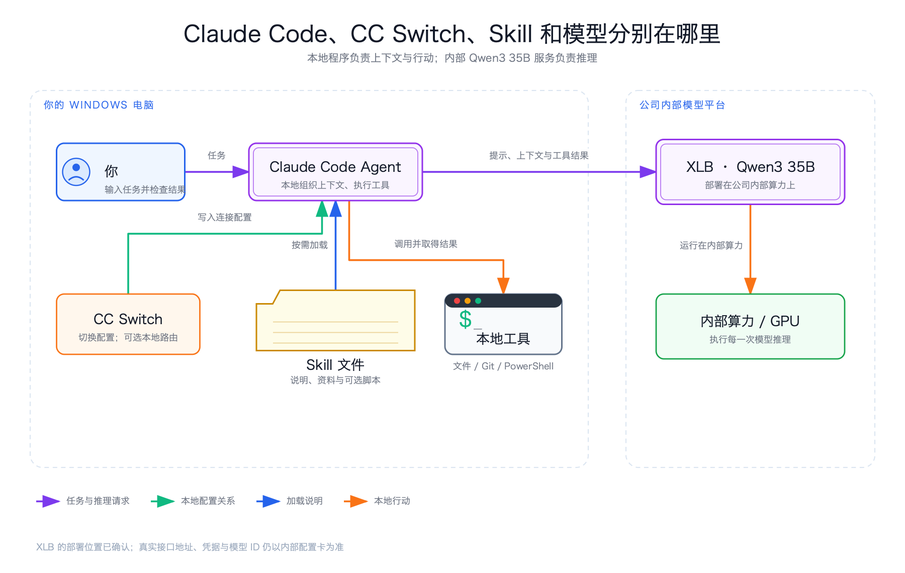

> 系列导读：[Agent 入门：给 Windows 小白的第一套地图](/posts/agent-basics/)

在 Windows 上打开 CC Switch，选中 XLB，再到 PowerShell 输入 `claude`。屏幕里很快出现一个能读项目、改文件、运行命令的 Agent。

这时最容易冒出一个误解：“我已经把 XLB 模型装进电脑，Claude Code 就是这个模型，Skill 是给模型加的新能力。”

这三个判断都把不同层级挤在了一起。**你安装到 Windows 的主要是 Agent 客户端和它的本地工具；模型推理通常发生在远端服务，CC Switch 负责配置路线，Skill 负责提供做事说明。**



## 先把六个名字放回原位

| 名称 | 通常在哪里 | 负责什么 |
| --- | --- | --- |
| Claude 模型 | Anthropic 或模型服务方的服务器 | 理解输入、判断下一步、生成文字或工具调用 |
| Claude Code | 你的 Windows 电脑 | 管理 Agent 循环、上下文、会话、工具与执行环境 |
| Tool | 本机或它连接的服务 | 读写文件、搜索、执行 PowerShell、访问外部系统 |
| Skill | 本机配置目录中的 Markdown 文件及配套资源 | 向 Agent 提供可复用的知识、步骤和工作方式 |
| CC Switch | 通常是本机第三方配置工具 | 切换服务地址、凭据或模型配置；也可按 API 格式开启本地路由 |
| XLB | 公司内部算力 | 本系列中指内部部署的模型服务，内部简称为“Qwen3 35B” |

Claude 模型和 Claude Code 是 Anthropic 的产品；Claude Code 提供自己的内置工具，并实现了 Skill 机制。**Tool 是通用概念，Agent Skills 也是开放标准，不能把它们都算成 Anthropic 产品。**CC Switch 是第三方工具，XLB 是公司内部模型服务；能与 Claude Code 配合，不等于它们变成了 Claude Code 的一部分。

## Claude 是“脑”，Claude Code 是“工作台”

“Claude”这个名字有时指聊天产品，有时指模型。讨论这套 Agent 结构时，我们先用它指负责推理的模型。

模型收到任务、当前对话、读到的文件片段和工具结果，然后决定回答什么或下一步调用什么工具。Claude Code 则是模型外面的运行框架。Anthropic 的官方说明写得很直接：Claude Code 提供工具、上下文管理和执行环境，把模型包进 Agent 循环。[How Claude Code works](https://code.claude.com/docs/en/how-claude-code-works)

所以，安装 `claude` 命令不等于把完整大模型下载到电脑。Claude Code 会把需要推理的请求发往配置好的服务；模型返回决定后，Claude Code 再在本机执行相应工具。官方对本地环境的定义也是：代码和工具在你的机器上运行。[执行环境说明](https://code.claude.com/docs/en/how-claude-code-works#execution-environments)

一条典型路径可以写成：

```text
你输入任务
  -> Windows 上的 Claude Code 组织上下文
  -> 路线 A：直接请求兼容 Anthropic Messages 的内部接口
     或路线 B：先进入本机 CC Switch Routing，再转换并转发
  -> XLB 内部模型服务
  -> 模型决定回复或调用工具
  -> Claude Code 在 Windows 上执行工具
  -> 工具结果再次交给模型判断
```

这正是上一篇讲的“收集—行动—核对”，只不过现在看清了每一步由谁完成。

## Tool 是手，Skill 是操作手册

Tool 能产生现实动作。读取一个文件、执行 `git status`、搜索网页，都是工具。没有工具，模型只能输出文字；有了工具，结果会回到 Agent 循环，影响下一步判断。[Claude Code 工具说明](https://code.claude.com/docs/en/how-claude-code-works#tools)

Skill 不等于 Tool。官方定义中，Skill 的入口是 `SKILL.md`，内容可以是知识、说明或多步流程；Claude Code 在任务相关时加载它，也可以由用户直接调用。Skill 还能带参考资料和脚本，但 Skill 本身首先是一份供模型理解和遵循的工作说明。[Claude Code Skills](https://code.claude.com/docs/en/skills)

例如，“查询合同数据”的接口是 Tool；“先查合同，再按批次归纳风险，最后形成待审草稿”是 Skill。前者给 Agent 一只手，后者告诉它这只手该怎样用于公司的工作。

## CC Switch 切的是配置，不负责推理

Anthropic 官方支持把 Claude Code 指向组织的 LLM 网关。通用方式是设置 `ANTHROPIC_BASE_URL`，再提供令牌或 API Key。官方同时强调：`ANTHROPIC_BASE_URL` 只改变请求发往哪里，并不自动决定由哪个模型回答；模型还需要单独配置。[网关连接](https://code.claude.com/docs/en/llm-gateway-connect)与[模型配置](https://code.claude.com/docs/en/model-config)是两个层面。

在目标 Windows 实机上确认之前，我们只能把 CC Switch 理解成“帮助切换这些配置的第三方界面”。它到底改了环境变量、`settings.json`，还是开启了本地路由，需要观察实际配置和运行状态。界面显示“切换成功”也只证明它完成了自己的操作，不能单独证明真实请求走了哪条路。

验收方式取决于 CC Switch 采用哪条路线。直接连接兼容 Anthropic Messages 的服务时，可以在 Claude Code 里运行 `/status`，检查 `Anthropic base URL`、认证来源和当前模型，再发一条真实消息。[官方网关检查方法](https://code.claude.com/docs/en/llm-gateway-connect#check-for-an-existing-configuration)如果 CC Switch 开启了本地路由与接管，`/status` 看到的可能是 `127.0.0.1` 一类本地地址；这时还要结合 CC Switch Routing 页的当前 Provider 和请求计数，才能确认请求是否继续转发到 XLB。安装篇会分别给出验收方法。

## XLB 是公司内部的模型服务

本系列采用公司内部口径：**XLB 指部署在内部算力上的模型服务，“Qwen3 35B”是这项服务的内部简称，不是本文核实过的公开标准型号或可直接填写的模型 ID。**准确模型 ID 必须以内部配置卡为准。选择 XLB 不是把模型下载到个人电脑，而是让 Claude Code 把推理请求发往公司内部接口，再由内部算力完成推理。

这里还要保留一条产品边界：内部所称的 Qwen 模型不是 Claude 模型。这是一条公司内部验证的兼容接入路径，不是 Anthropic 官方承诺支持的组合。Anthropic 官方说明并不支持通过第三方网关把 Claude Code 路由到非 Claude 模型，也不保证全部功能都能正常工作。[Other LLM gateways](https://code.claude.com/docs/en/llm-gateway)

把层级分清以后，排错也会简单许多：命令无法读文件，先看 Claude Code 与本机工具；Skill 没触发，先看 Skill 的位置和说明；请求认证失败，查内部服务地址与凭据；XLB 回答异常，则检查内部模型服务和兼容接口。不要让一个名字替整条链路背锅。

---

上一篇：[Agent 入门 01｜聊天机器人和 Agent](/posts/agent-basics-01-chat-agent/) ｜ 下一篇：[Agent 入门 03｜在 Windows 上装好 Claude Code](/posts/agent-basics-03-windows-setup/)
