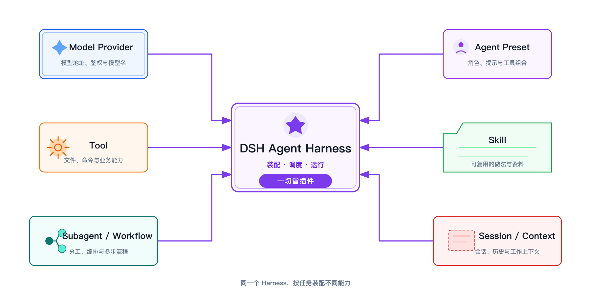

> 系列导读：[Agent 入门｜从会回答，到能完成任务](/posts/agent-basics/)

模型能理解问题并生成文字，但“能回答”还不等于“能做事”。要让模型读取工作区、调用工具、保留任务上下文并检查结果，还需要一个把这些部件组织起来的运行系统。这个系统通常叫 **Agent Harness**。

[DeepSeek Harness（DSH）](https://github.com/deepseek-ai/deepseek-harness) 是一个 Agent Harness。它不是另一个模型，也不是套在模型外面的聊天皮肤。它负责把模型、循环、工具、Skill 和任务上下文接成一个可以持续工作的 Agent。

## “Everything is a Plugin”是什么意思

DSH 官方仓库用一句话概括自己的架构：**Everything is a Plugin**。

这里的 Plugin 不是浏览器里可有可无的小扩展，而是系统的基本装配单位。模型接入、Agent 循环、文件工具、Skill 目录、会话记录和界面能力，都可以作为不同部件加入运行环境。DSH 提供装配和协作机制，具体能力则由这些插件贡献。

这样做的结果是：Agent 不再是一个固定软件，而是一组被组合出来的能力。同一个 DSH 可以装配出偏向文档整理的 Agent，也可以装配出偏向代码、搜索或业务查询的 Agent。它们可能使用同一个模型，但能看见的说明、能调用的工具和适合完成的任务并不相同。

因此，判断一个 Agent 能做什么，不能只问“它用了什么模型”。还要问：它被装上了哪些插件，获得了哪些 Tool 和 Skill，又在什么任务上下文里运行。

## Session：一次工作持续存在的容器

聊天界面里的一次问答很容易让人以为，每条消息都是独立发生的。Agent 的实际工作却常常跨越多步：先理解目标，再查看材料，然后行动，最后根据工具结果继续判断。

**Session** 就是承载这段连续工作的容器。它保存这次任务的对话和事件，让后一步能够接着前一步产生的结果继续，而不是每次都从空白开始。模型的一次回答只是 Session 里的一个步骤；工具调用、工具返回和后续修正也属于同一条任务轨迹。

Session 不是模型的“长期记忆”，也不会自动理解电脑里的所有文件。它只保留被带进这次工作过程的内容。换一个 Session，相当于打开另一张工作台：任务历史、当前上下文和正在处理的目标彼此分开。

## Agent Preset：决定这个 Session 里的 Agent 是谁

如果 Session 是一张工作台，**Agent Preset** 就是开工前摆到台面上的那套装备。

按照 DSH 的 [Preset 说明](https://github.com/deepseek-ai/deepseek-harness/blob/master/packages/preset/README.md)，一个 Agent Preset 是一份按 Session 挂载的组合。它可以给这个 Session 带来自己的工具、提示内容和角色设定，而其他 Session 仍保留各自的组合。

Preset 解决的不是“这次问什么”，而是“由什么样的 Agent 来做”。例如：

- 文档 Agent 可以获得文件读取、文档生成和格式检查能力；
- 调研 Agent 可以获得搜索、网页读取和来源整理能力；
- 业务 Agent 可以获得特定业务 Tool，以及对应的术语和操作 Skill。

DSH 会在新建 Session 时确定它使用的 Preset。官方的 [Preset 界面说明](https://github.com/deepseek-ai/deepseek-harness/blob/master/packages/client/ui-agent-preset/README.md)也明确指出：运行中的 Session 不会临时换成另一套 Preset，因为它此前的历史是由原来那套工具和提示产生的。想换一种 Agent，应当新建 Session，再选择新的组合。

## 模型、Tool 和 Skill 怎样进入同一个 Agent

这几个部件分工不同：

| 部件 | 在一次任务中负责什么 |
|---|---|
| 模型 | 理解目标、判断下一步、解释工具返回的结果 |
| Agent 循环 | 让“观察—行动—核对”可以反复进行 |
| Tool | 真正接触外部环境，例如读取文件、查询数据或写入结果 |
| Skill | 告诉 Agent 某类任务该在什么时候用什么步骤和工具 |
| Agent Preset | 选择并组合这个 Agent 可以使用的提示、Tool 与 Skill |
| Session | 承载这次工作的上下文和过程 |

一次任务开始后，模型先根据目标和 Session 中已有的信息判断下一步。如果需要查看真实材料，Agent 就调用 Preset 提供的 Tool；如果任务命中了某项专业做法，再加载对应 Skill。工具结果回到 Session，模型读到新的现场结果后继续判断，直到任务完成或需要人补充信息。

这里没有哪个部件可以单独替代其他部件。模型没有 Tool，只能根据输入生成内容；Tool 没有模型，不知道何时调用；Skill 只是一套做法，不会自己执行；Preset 负责组合能力，却不保存具体任务的连续过程。

这也是 DSH 的核心价值：它不是声称“一个模型什么都会”，而是让不同能力以插件方式进入合适的 Agent，再由 Session 把一次真实工作连续地跑完。

---

[上一篇：Agent 入门 02｜模型、Harness、Agent、Tool 与 Skill 如何协作](/posts/agent-basics-02-claude-code-stack/) ｜ [下一篇：Agent 入门 04｜第一个真实任务：为什么要小、真、可恢复](/posts/agent-basics-04-first-task/)
