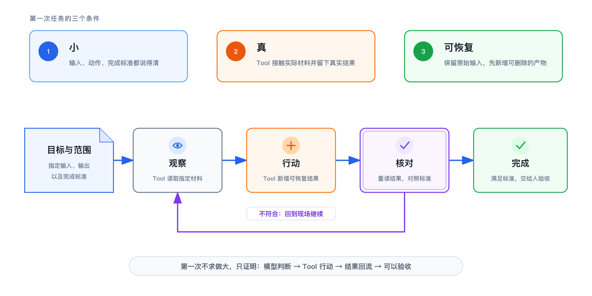

> 系列导读：[Agent 入门｜从会回答，到能完成任务](/posts/agent-basics/)

第一次观察 Agent 工作，不适合用一句“帮我把这个项目处理好”开场。任务越大，过程中发生的动作越多，越难判断它到底理解了什么、做了什么，又在哪一步出了偏差。

一个合适的起点有三个特征：**小、真、可恢复**。这三个条件把 Agent 的工作压缩成一条能看清的链路：观察真实材料，执行一个有限动作，再用可见结果完成核对。

## 小：输入、动作和完成标准都能说清

“小”不只是文件少，也不是要求 Agent 少想几步。它指的是任务边界可以被准确描述。

例如，把三份会议记录整理成一份行动清单，就是一个小任务。输入是指定的三份文件；动作是提取事项、负责人、截止时间和待确认信息；输出是一份新文档；完成标准是每条任务都能在原文里找到依据。

相反，“整理一下整个项目”没有说明要看哪些材料、留下什么结果，也没有回答怎样才算完成。Agent 即使做了很多动作，你也很难区分它是在推进任务，还是只是在扩大范围。

小任务的价值不是保守，而是可观察。输入和输出越清楚，越容易看见模型怎样判断、Tool 怎样行动，以及结果是否来自真实材料。

## 真：让 Tool 接触实际对象

普通 Chat 也能把一段粘贴进去的会议记录整理成表格，但那次工作只发生在对话里。Agent 任务的关键变化，是系统能够通过 Tool 接触一个真实对象：工作区里的文件、数据库中的记录、网页上的内容，或某个业务系统提供的接口。

仍以会议记录为例。Agent 不是凭空写一份“看起来像行动清单”的文本，而是先读取指定文件，识别人名、事项和日期，再创建一个能够重新打开的结果。输入来自真实环境，输出也回到真实环境，任务才真正跨出了聊天窗口。

“真”不等于一上来就处理最重要的数据。它只要求材料和动作不是假想的。一个专门准备的工作目录同样是真实环境：里面确实有文件，Agent 确实读取和写入，结果也确实留在磁盘上。

## 可恢复：做错以后能退回原点

第一次任务最适合“新增一份结果”，不适合“直接改掉所有原文”。原因很简单：新增文件可以删除重做，原始材料仍然保留；批量覆盖、发送消息或改写正式记录，一旦做错，恢复成本会立刻升高。

可恢复不是要求 Agent 永远只读，而是让第一次行动留下清楚的返回路径。原始输入不变，产物单独保存，人在核对后再决定是否采用。这时即使结果不理想，也能准确判断是目标没说清、事实提取错了，还是输出格式不合适。

这条原则可以迁移到很多场景：先生成邮件草稿，而不是直接发送；先输出重命名清单，而不是立刻改几百个文件；先生成数据核对报告，而不是直接更新正式数据。

## Agent 的最小循环：观察、行动、核对

任务被限定为小、真、可恢复之后，Agent 的循环就能完整显现。

**观察**不是泛泛地“了解情况”，而是调用 Tool 读取指定对象。模型从工具返回中区分已知事实、缺失信息和任务要求。会议记录里没有写开始时间，观察阶段得到的结论就应当是“未提供”，而不是猜一个合理时间。

**行动**是把判断变成环境中的变化。模型选择写入工具，按照约定结构创建行动清单。真正写文件的是 Tool；模型负责决定写什么、写到哪里，以及下一步需要什么结果。

**核对**也不是让 Agent 再说一句“已经完成”。它要重新读取输出，把负责人、日期和待确认项逐条对回原始材料。工具返回的文件内容成为新观察，模型才能判断结果是否满足完成标准。发现不一致，就修正并再次核对。

于是，一次 Agent 任务不是直线：

~~~text
目标 → 观察真实材料 → 调用 Tool 行动 → 读取结果 → 对照标准 → 完成或继续
~~~

这个循环解释了 Agent 与一次性文本生成的差别。Chat 的回答可以成为工作材料；Agent 则能把回答变成动作，再让动作产生的新结果进入下一轮判断。

## 先写清“完成”，再交给 Agent

一个任务是否适合交给 Agent，可以先看四件事：目标是什么，允许读取哪些输入，要留下什么结果，如何确认结果正确。四项都清楚，Agent 才有机会在有限范围内形成闭环。

如果完成标准只能写成“效果好一点”，任务还没有小到能核对；如果必须直接覆盖唯一原件，它还不够可恢复；如果 Agent 接触不到真实输入，那仍然只是一次聊天练习。

第一个任务不需要展示 Agent 能做多大的事。它只需要证明一件更基础的事：模型的判断能够通过 Tool 落到真实环境，而工具产生的结果又能回来接受检查。

---

[上一篇：Agent 入门 03｜DSH 是什么：Agent 如何被组合出来](/posts/agent-basics-03-windows-setup/) ｜ [下一篇：Agent 入门 05｜Skill 是什么：把做法按需交给 Agent](/posts/agent-basics-05-skill/)
