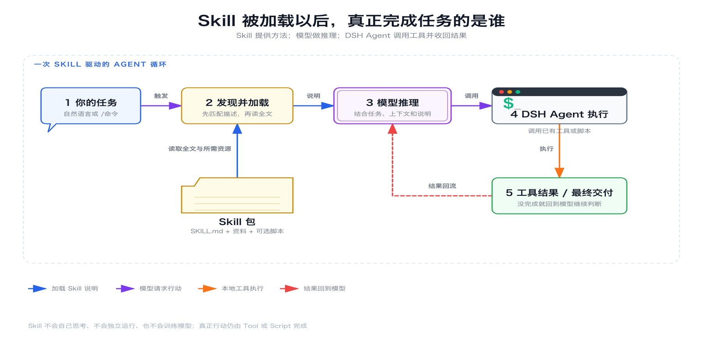

> 系列导读：[Agent 入门｜从会回答，到能完成任务](/posts/agent-basics/)

同一类任务反复出现时，每次都从头解释做法，会让关键步骤散落在不同对话里。**Skill** 的作用，就是把一套可复用的方法整理出来，并在合适的任务中交给 Agent。

Skill 不是新模型，也不会自己执行任务。它更像一份带触发条件的作业说明：什么时候该用、按什么步骤做、应当调用哪些 Tool、输出满足什么标准，以及需要时到哪里读取模板或运行 Script。

## Skill 改变的是做法，不是模型智力

模型负责理解和推理，Agent 负责在目标周围循环，Tool 负责接触真实环境。Skill 位于它们之间：把某个领域已经形成的做法交给 Agent，让模型不必每次临时发明流程。

| 部件 | 作用 |
|---|---|
| 模型 | 理解任务，判断下一步 |
| Agent | 围绕目标持续观察、行动与核对 |
| Harness | 管理 Session、上下文，并调度模型与工具 |
| Skill | 提供某类任务的触发条件、步骤和完成标准 |
| Tool | 读取文件、查询数据、写入结果等真实动作 |
| Script | 完成格式转换、计算或校验等确定性处理 |

因此，同一个模型加载不同 Skill，做事方式可以不同；但 Skill 不会让模型凭空知道缺失的事实，也不会自动给 Agent 增加一个不存在的 Tool。说明书可以规定“查询订单后核对日期”，前提仍是当前 Agent 确实拥有查询订单的工具。

## 为什么先给目录，不直接塞进全部说明

如果一个 Agent 拥有几十项 Skill，而每次任务都把全部正文放进上下文，大量无关说明会挤占模型注意力。DSH 采用的是“先看目录，命中后再读正文”的方式。

根据 DSH 的 [Skills 官方说明](https://github.com/deepseek-ai/deepseek-harness/blob/master/docs/subsystems/skills.md)，模型最初看到的目录只包含允许模型调用的 Skill 名称和简短描述，不包含完整正文、绝对路径或全部资源。描述与当前任务匹配后，Agent 才通过 Skill Tool 读取完整定义。

这使 Skill 的 `description` 不只是介绍文字，而是路由入口。描述写得太宽，Agent 会在无关任务中加载它；写得太窄，真正需要时又可能找不到。好的描述应当说清“什么任务出现时使用”，而不是只写“一个很有用的助手”。

## DSH 中的一次 Skill 如何运行

把过程展开，可以看到五个连续环节：

1. **Catalog**：DSH 汇总当前 Session 可见的 Skill 名称和描述，形成目录。
2. **选择**：模型根据目录中的名称和描述，决定调用某项 Skill Tool；用户也可以在任务中直接点名。
3. **按需加载**：Agent 调用 `skill({ name })`，取得完整说明和被明确引用的资源。
4. **Tool / Script 执行**：Agent 按说明读取材料、调用业务 Tool，或运行 Skill 提供的 Script。
5. **结果回流**：真实执行结果回到 Session，模型据此判断下一步、组织回答或继续核对。

关键点在最后两步。Skill 本身只是指导，它不会越过 Tool 直接碰到文件或数据；Script 只会完成被调用的确定性动作，也不会自己理解整个任务。模型读到 Tool 或 Script 的返回后，Agent 循环才继续运行。

DSH 也不会在加载 Skill 时把整个目录无差别塞进上下文。官方说明指出，只有 Skill 明确引用到的脚本、参考资料或资源，才会在需要时解析。这让一项 Skill 可以带着模板、例子和辅助程序，又不必让每次调用都读取全部内容。

## 用“会议纪要 Skill”看清分工

假设一项 Skill 用来把会议记录整理成行动清单。它可以包含四类信息：

- 触发条件：出现“整理会议纪要、提取待办”一类任务时使用；
- 工作步骤：先找事项、负责人和日期，再区分已确认与待确认内容；
- 输出规则：按照统一栏目生成行动清单，并保留来源依据；
- 可选资源：文档模板，或用于清洗特殊格式的 Script。

当任务命中这项 Skill，Agent 读取完整做法，然后调用文件 Tool 查看会议记录。若原始格式需要转换，再调用 Script；转换结果回到模型后，Agent 继续提取事实并生成文档。最后，它重新读取结果，按照 Skill 规定的标准核对。

这条链路里，事实来自原始文件，读写能力来自 Tool，固定转换来自 Script，任务判断来自模型。Skill 的贡献，是规定这些部件在什么条件下、按什么次序协作。

## 什么做法值得变成 Skill

不是提示词长，就应该做成 Skill。至少要满足三个条件：任务会重复出现；步骤已经相对稳定；完成标准能够说清。会议纪要、固定格式的检查、重复使用的调研方法，都可能满足这些条件。

如果任务只发生一次，或团队还不知道正确流程是什么，直接和 Agent 对话通常更合适。过早写成 Skill，只会把尚未验证的习惯固化下来。

Skill 的边界也很明确：它能复用方法，不能制造事实。材料里没有截止时间，再完整的 Skill 也只能标为待确认。真正可靠的 Skill，不是让 Agent 显得什么都知道，而是让它在该知道的时候加载正确做法，在不知道的时候保留未知。

---

[上一篇：Agent 入门 04｜第一个真实任务：为什么要小、真、可恢复](/posts/agent-basics-04-first-task/) ｜ [下一篇：Agent 入门 06｜什么样的任务适合交给 Agent](/posts/agent-basics-06-scenarios/)
