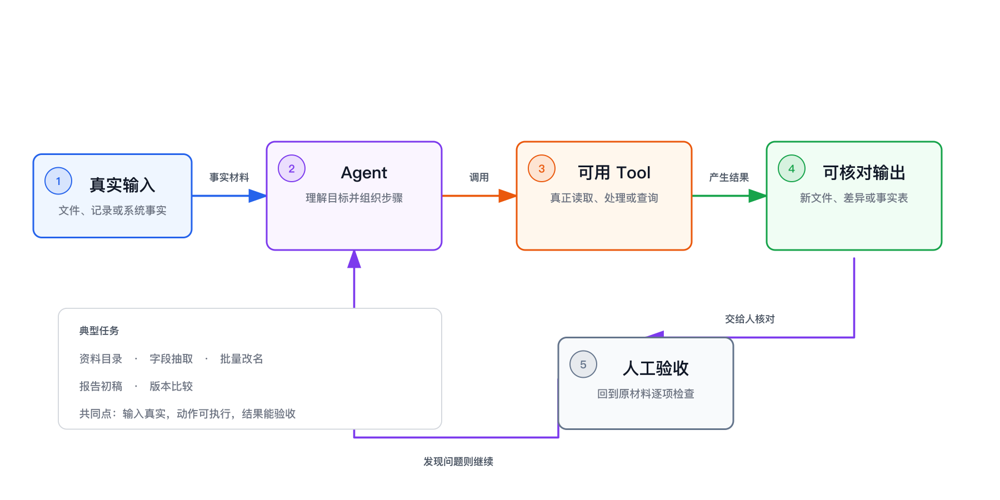

> 系列导读：[Agent 入门｜从会回答，到能完成任务](/posts/agent-basics/)

“Agent 能做什么”很容易被答成一张越来越长的场景清单：整理资料、分析数据、生成报告、修改代码、处理图片……但清单有一个问题：它只能告诉你别人做过什么，不能帮你判断眼前这个新任务是否适合 Agent。

真正决定成败的不是行业，也不是文件格式，而是任务结构。一个适合 Agent 的任务，通常同时具备三样东西：**有真实输入，有可用 Tool，有能够核对的输出。** 三者连起来，模型才不只是“说一段像答案的话”，而是能对现实材料采取动作，并根据结果继续调整。

## 真实输入把任务钉在事实上

真实输入是任务已经拥有的材料。它可能是一组文件、一张表、一段会议记录，也可能是某个系统返回的数据。它的作用不是给 Agent 增加背景知识，而是给这次工作划出事实边界。

例如，“分析本周项目风险”听起来像任务，其实没有告诉 Agent 风险从哪里来。它只能依靠常见说法补出一份流畅但空泛的分析。换成“根据本周项目记录和问题清单，找出延期、缺口与待确认事项”，Agent 才有东西可读，结论也有地方可追溯。

输入越真实，不等于材料越多。把十年的文件全部丢进去，往往只会增加噪声。关键是材料与问题之间存在明确关系：要比较版本，就提供两个版本；要汇总进展，就提供这一周期的记录；要查异常，就提供正常规则和实际结果。

## Tool 让判断能够变成动作

模型本身只能生成内容和调用意图，不能直接改变文件或系统。Tool 把它接到文件、浏览器、数据库或其他程序上，Agent 才能读取材料、运行处理、保存结果、再查看结果是否符合预期。

所以，同一句“整理这批资料”，有没有 Tool，实际上是两种任务。没有 Tool 时，你只能把内容逐段贴进聊天窗口，得到一段建议或整理后的文字。有 Tool 时，Agent 可以先查看有哪些资料，再逐份读取，最后生成一份新的目录或汇总文件。模型负责判断下一步做什么，Tool 负责让那一步真的发生。

这里也有一个容易忽略的边界：有 Tool 不代表什么都能做。Agent 只能使用已经提供、而且适合当前材料的能力。它能读取文本，不等于能识别模糊扫描件；它能生成表格，不等于能进入一个没有开放接口的业务系统；它能准备邮件草稿，也不等于拥有正式发送的权限。

## 可核对的输出告诉 Agent 何时停下

很多任务失败，不是 Agent 没有行动，而是它没有可判断的终点。“整理好一点”“分析深入一点”“做得专业一些”，都没有稳定的完成标准。Agent 可能很快停下，也可能反复润色，却无法知道哪一次已经足够。

可核对的输出不一定是文件，但必须能被观察。它可以是一张包含固定字段的表、一份引用原文的差异说明、一组成功完成的处理结果，或一个按给定条件筛出的清单。核对也不等于要求结果绝对正确，而是让人和 Agent 都能回答：输入是否覆盖，关键事实能否追溯，格式是否符合约定，失败项是否明确留下。

这也是 Agent 与普通自动化的区别之一。固定流程适合规则稳定、每一步都已知的任务；Agent 更适合中间步骤需要根据材料变化而调整，但最终结果仍然可以检查的任务。它可以自己决定先读哪份文件、何时换一种方法，却不能把“我觉得完成了”当作验收。

## 三个条件少一个，任务都会变形

只有输入、没有 Tool，适合先聊天分析；你需要自己搬运材料和执行动作。只有 Tool、没有真实输入，Agent 可以忙起来，却不知道该依据什么判断。已有输入和 Tool、但没有可核对的输出，过程看似完整，结果仍只能凭感觉接受。

还有一些任务即使满足三项，也不应把最后判断完全交给 Agent。签署合同、批准付款、作出人事决定或对外承诺，结果不仅要“看起来正确”，还涉及授权、责任和难以逆转的后果。Agent 可以搜集证据、指出矛盾、生成草稿，但做决定的人不能从链路中消失。

因此，判断一个新场景时，不必先问“有没有人用 Agent 做过”。把任务换一种问法：事实从哪里来，它能调用什么去行动，产出又怎样被核对？三个问题都有具体答案，这个任务才真正具备 Agent 可以工作的形状。

---

上一篇：[Agent 入门 05｜Skill 是什么：把做法按需交给 Agent](/posts/agent-basics-05-skill/) ｜ 下一篇：[Agent 入门 07｜怎样给 Agent 交代清楚任务](/posts/agent-basics-07-task-brief/)
