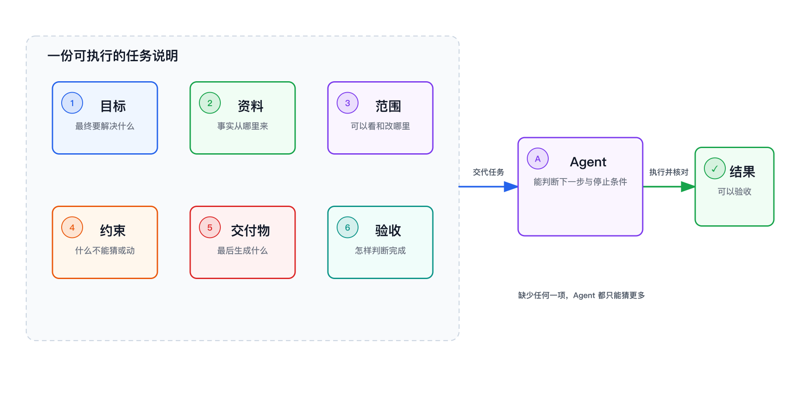

> 系列导读：[Agent 入门｜从会回答，到能完成任务](/posts/agent-basics/)

给 Agent 交代任务，不是在比赛谁的提示词写得更像咒语。真正困难的是：人说“整理一下”时，脑中往往已经藏着资料范围、使用对象、不能碰的内容和对“整理好”的判断；Agent 看不到这些默认条件。

一份有效的任务说明，要做的就是把隐含条件搬到台面上。最实用的六个要素是：**目标、资料、范围、约束、交付物、验收标准。** 它们不是为了把一句话写长，而是共同构造一个 Agent 可以判断的终点。

## Agent 缺的通常不是指令，而是终点

“把这些项目记录整理成一份好一点的周报”，人似乎能听懂，Agent 却必须连续猜测：“这些”包括哪些记录？周报给谁看？哪些内容必须保留？结果是一段文字还是一个文件？怎样才算“好一点”？

每一次猜测都会分叉。即使 Agent 写出了一篇很顺的周报，也可能遗漏某个项目、把计划写成进展，或者采用了不合适的口吻。问题不一定出在模型能力上，而是任务没有提供判断方向和停止条件。

六要素恰好接住了这些分叉。**目标**说明这次工作要改变什么，以及结果给谁使用；**资料**指出事实从哪里来；**范围**划定本次处理到哪里为止。前三项先建立一块明确的工作现场。

接下来，**约束**排除那些表面可行、实际不能接受的做法，例如不得补写没有来源的数字，不得修改原始材料；**交付物**把结果变成可打开、可转交的东西；**验收标准**则告诉 Agent，出现哪些可观察的事实，才算抵达终点。

## 六项不是格式，而是一条闭环

可以把任务说明想成一次从事实到结果的闭环。资料提供起点，目标拉出方向，范围与约束修剪可走的路径，交付物承接动作，验收标准再回头检查结果是否真的回应了目标。

例如，一项任务可以这样交代：根据本周的项目记录，为部门例会准备一份进展摘要；只使用指定周期内的记录，不改原文；无法从材料确认的日期标成“待确认”；结果包含已完成、进行中、风险和下一步四部分；完成时，每个项目都应出现，所有日期都能回到来源。

这段话没有规定 Agent 必须先读哪份文件，也没有替它设计每一步操作。它规定的是事实边界和结果边界。中间路线仍由 Agent 根据材料决定，但无论选择哪条路线，都要回到同一组验收条件。

这也是为什么“步骤写得很详细”不等于“任务交代得很清楚”。如果只规定先做 A、再做 B、最后做 C，却不说明结果应该满足什么，Agent 即使逐步照做，也无法发现输入缺失或结果偏离。反过来，一项任务只要起点、边界和终点清楚，Agent 往往可以自己补出合理步骤，并在行动后修正。

## 验收标准把模糊评价变成事实

六项中，最容易缺失的是验收标准。人习惯在看到结果后才说“不是我想要的”，因为我们能凭经验感到哪里不对。但 Agent 要在执行过程中判断是否继续，就需要更早知道差异会出现在哪里。

好的验收标准描述可观察的结果。“语言专业”仍然含糊；“给部门内部阅读，少用宣传语，保留所有风险项”更容易检查。“资料不要遗漏”也不够；“输入中的每个项目都出现在正文或未采用说明中”才形成闭环。

验收标准也不该塞进所有可能的担忧。只保留会改变成败判断的几项：覆盖是否完整，关键事实能否追溯，输出结构是否正确，哪些错误不能出现。标准越接近真实用途，Agent 越容易在完成前自己发现偏差。

## 什么时候只需要 Chat，什么时候需要 Agent

Chat 和 Agent 的边界，不在于问题难不难，而在于任务是否需要走出对话，访问外部材料或改变外部状态，再观察结果。

如果你想理解一个概念、比较几个观点、推敲一段已经贴出的文字，交付物就是眼前这次回答，Chat 更直接。即使问题很难，只要它主要发生在对话中，也未必需要 Agent。

当任务要读取一组材料、调用 Tool、生成或修改交付物，并根据结果继续检查时，它才有了 Agent 的结构。即使任务看起来很小，例如比较两份文件，只要中间需要实际读取、行动和核对，Agent 也比一次回答更合适。

边界并非固定。有时可以先用 Chat 把目标想清楚，再把成熟的任务说明交给 Agent；Agent 做完后，也可以回到 Chat 讨论取舍。关键不是选一个更高级的名字，而是看当前这一步需要的是思考，还是一条能行动并闭环的工作链。

写任务说明时，最后问自己一句就够了：如果执行者做完回来，我凭什么判断它已经完成？这个答案一旦能落到输入、边界、交付物和可观察的结果上，Agent 才真正拿到了终点。

---

上一篇：[Agent 入门 06｜什么样的任务适合交给 Agent](/posts/agent-basics-06-scenarios/) ｜ 返回：[系列导读](/posts/agent-basics/)
