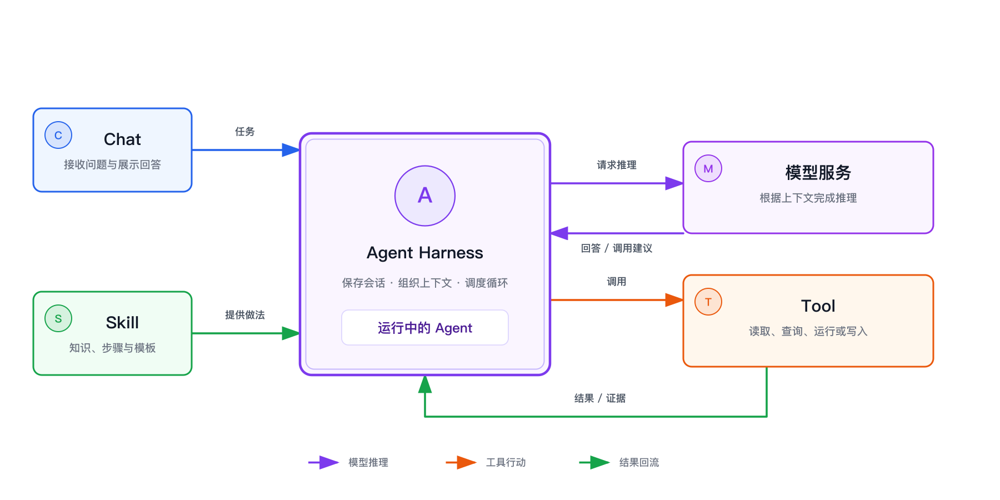

把一份材料发给 AI，请它概括重点，我们期待的是一段回答。把一个资料目录交给 Agent，请它归类文件、生成清单并检查结果，我们期待的是现场发生变化。

这两件事都可能从一个聊天框开始，也都可能使用同一个大语言模型。真正的差别不在界面，更不在模型名字，而在模型之外有没有一套运行机制：取得现场、调用工具、观察结果，再决定下一步。

**模型负责推理；Harness 把推理和行动组织成循环；Tool 接触真实环境；Skill 告诉 Agent 怎样完成某一类任务。** 理解这条关系，比记住任何一个产品的按钮都更有用。

## 先把七个词放回原位

| 名称 | 它在整条链路里负责什么 |
|---|---|
| 模型 | 根据输入和上下文生成文字，或判断下一步动作 |
| 模型服务 | 接收推理请求，运行模型，再返回结果 |
| Chat | 让人与 AI 通过一轮轮消息交换信息 |
| Harness | 保存会话、整理上下文、调度模型和工具 |
| Agent | 围绕目标持续观察、行动和核对的工作方式 |
| Tool | 读取文件、运行命令、查询系统或写入结果 |
| Skill | 为一类任务提供可复用的知识、步骤和模板 |

这七个词不是七个并列产品。模型和模型服务属于推理层；Tool 属于行动层；Harness 把两层接起来。Agent 则是这套系统围绕一个目标运行时呈现出来的整体行为。

因此，模型本身不是 Agent。一个模型即使很聪明，没有文件、浏览器、命令行或业务接口，也只能根据拿到的文字作答。反过来，装了很多 Tool 也不等于任务就会自动完成：Harness 还要把工具结果送回模型，让模型根据新的现场结果继续判断，直到结果可以验收。

## Chat 和 Agent 不是两个互斥的产品类别

Chat 首先是一种交互形态。你说一句，AI 回一句。Agent 首先是一种工作方式：它能不能取得真实上下文，能不能采取行动，能不能看到行动结果，并据此继续工作。

所以，同一个产品可以既有 Chat，也有 Agent 模式；Agent 也完全可以通过聊天界面和人协作。判断它正在做哪一种工作，不要看界面像不像聊天，而要看这一轮是否闭合了“观察—行动—核对”的循环。

## 这套文章想解决什么

这不是一套软件安装手册，也不要求先记住某个产品。我们先把不会轻易过时的原理说清，再用 DSH 作为一个具体的 Agent Harness 示例，看看抽象概念怎样落到真实系统里。

读完后，你应该能判断：

- 一次对话为什么不会现场重新训练模型；
- 一段流畅回答和一次真实执行差在哪里；
- 模型、模型服务、Harness、Agent、Tool、Skill 分别在哪一层；
- Skill 为什么能改变做事方式，却不是给模型增加参数；
- 什么任务适合交给 Agent，什么任务只需一次问答；
- 怎样描述目标和完成标准，让结果能够被检查。

## 系列目录

### 第一部分：看懂这台机器

1. [00｜模型、训练与聊天：你没有在对话里训练它](/posts/agent-basics-00-model-chat/)
2. [01｜Chat 和 Agent，差别究竟在哪里](/posts/agent-basics-01-chat-agent/)
3. [02｜模型、Harness、Agent、Tool 与 Skill 如何协作](/posts/agent-basics-02-claude-code-stack/)

### 第二部分：看懂一次真实运行

4. [03｜DSH 是什么：Agent 如何被组合出来](/posts/agent-basics-03-windows-setup/)
5. [04｜第一个真实任务：为什么要小、真、可恢复](/posts/agent-basics-04-first-task/)

### 第三部分：从能运行到会判断

6. [05｜Skill 是什么：把做法按需交给 Agent](/posts/agent-basics-05-skill/)
7. [06｜什么样的任务适合交给 Agent](/posts/agent-basics-06-scenarios/)
8. [07｜怎样给 Agent 交代清楚任务](/posts/agent-basics-07-task-brief/)

## 带着三个判断往下读

第一，**回答不是行动。** AI 说“文件已经整理好”只是一句话；重新读取目录，看到文件确实移动到正确位置，才是结果。

第二，**Agent 不是某个模型的别名。** 换模型会改变推理质量，换 Tool 会改变它能接触什么，换 Skill 会改变它怎样做事，换 Harness 则会改变这些部分如何被组织。

第三，**完成必须能被验收。** 如果任务没有范围和完成标准，Agent 再忙也可能只是在不断产生动作。能停在哪里，取决于目标是否能和现场结果对上。

接下来从最容易混淆的一组词开始：[模型、训练、推理和聊天](/posts/agent-basics-00-model-chat/)。
