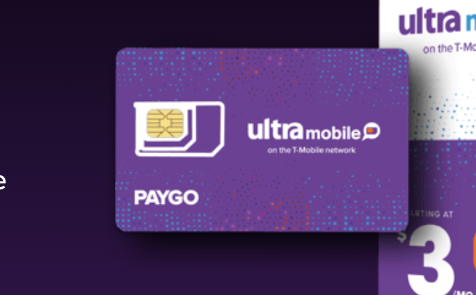

> 请注意，本文已由ChatGPT进行修改和润色

# 前言
数字移民旨在更便捷地获取和接触世界各地的优质资源，以缩小数字鸿沟。以下是一些相关的订阅服务和必需信息。
# 已订阅服务
1. Netflix（巴基斯坦区）：每月PKR 1100（约26.82元）
2. YouTube Premium（土耳其区）：每月TRY 29.99（约10.65元），于2022年11月从16.99涨至29.99
3. Disney+（土耳其区）：每月₺64.99（约23.08元）
4. iCloud（土耳其区）200G：每月₺19.99（约7.1元）
5. Apple Music（土耳其区）：每月₺9.99（约3.55元）
6. Apple Arcade（土耳其区）：每月₺34,99（约12.43元）
7. Ultra PayGo：每月3美元（约20.74元）
8. ChatGPT Plus：每月20美元（约138.96元）
9. GitHub Copilot：每年100美元（约695.2元）

# 电话号码
在香港和澳门，iPhone 13 mini、iPhone 12 mini、iPhone SE (第2 和第3 代) 以及iPhone XS 均提供eSIM 功能。需要注意的是，美版 iPhone 只支持 eSIM，在中国大陆会无法使用。

## Ultral PayGo
这是一项美国电话号码服务，收费为每月3美元。

购买途径为淘宝，需要自行激活。我选择的是纽约号码，在国内主要使用移动网络，信号十分稳定。在激活时需要用到梯子，但激活后则无需梯子，可以正常使用。

此号码成功绑定了美区 Paypal，应该可以绑定大部分境外服务。

# Wifi Calling

[这里](https://www.ultramobile.com/zh/wifi-talk-text/)列出了兼容无线网络通话的手机型号。

按照官方指导，你可以在线开通 Wifi Calling，无需额外付费。需要注意的是，开通的时候会需要美国的地址，你可以在Google Map 中随机选择一个。

# 信用卡

## Depay虚拟信用卡

网络上有大量关于Depay虚拟信用卡的开通教程。这里我们只需要注意几个关键点：
1. 为了安全考虑，尽量不要在卡上存储过多资金。
2. Depay只支持 USDT，你需要首先在币安充值，然后转到 Depay 钱包，再转换成美元，这个过程可能会有一定的损失。

尽管Depay虚拟信用卡具有一定的便利性，但如果条件允许，使用美国实体信用卡（如 Apple Card）仍然是更好的选择。

## 美国实体信用卡

如果你希望申请美国实体信用卡，以下步骤可能会对你有所帮助：

1. 租用一个美国的私人地址。
2. 获得美国邮政局USPS 1583 认证。要在 USPS 收取包裹，必须要进行这一步认证。通过这个方式，你可以将包裹转运到中国，但是需要注意，可能会进行抽查。
3. 一旦你有了私人地址和1583认证，你就可以尝试申请美国的信用卡。

请注意，这些步骤并不保证一定能成功获得信用卡，因为这还需要你满足银行或信用卡发行机构的其他申请要求。