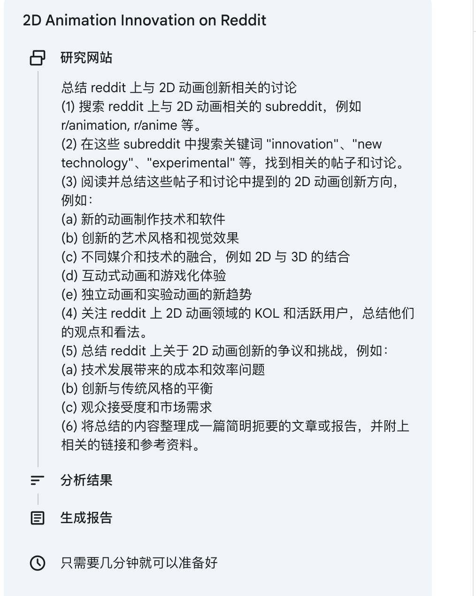

试用了 Gemini Deep Research 的一段时间，我发现它的效果非常好。我在这里记录一下我的使用体验。

给出提示词, 它会给出具体的研究方案.

如我给出一个非常简单的提示词
``` reddit 总结与2d 动画创新相关的 ``` , 它会总结生成以下研究方案:
```markdown
总结 reddit 上与 2D 动画创新相关的讨论
(1) 搜索 reddit 上与 2D 动画相关的 subreddit，例如 r/animation, r/anime 等。
(2) 在这些 subreddit 中搜索关键词 "innovation"、"new technology"、"experimental" 等，找到相关的帖子和讨论。
(3) 阅读并总结这些帖子和讨论中提到的 2D 动画创新方向，例如：
(a) 新的动画制作技术和软件
(b) 创新的艺术风格和视觉效果
(c) 不同媒介和技术的融合，例如 2D 与 3D 的结合
(d) 互动式动画和游戏化体验
(e) 独立动画和实验动画的新趋势
(4) 关注 reddit 上 2D 动画领域的 KOL 和活跃用户，总结他们的观点和看法。
(5) 总结 reddit 上关于 2D 动画创新的争议和挑战，例如：
(a) 技术发展带来的成本和效率问题
(b) 创新与传统风格的平衡
(c) 观众接受度和市场需求
(6) 将总结的内容整理成一篇简明扼要的文章或报告，并附上相关的链接和参考资料。
```



这个方案非常详细，包含了搜索 reddit、阅读帖子、总结内容、关注 KOL、总结争议等多个步骤，可以帮助我系统地了解 2D 动画创新的最新动态。我觉得 Gemini Deep Research 的研究方案非常实用，可以帮助我快速获取信息，提高研究效率。


