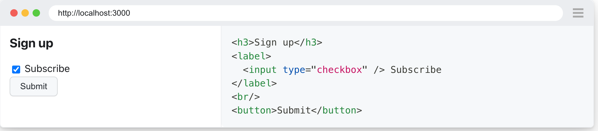

## 20230602
## Playwright

Playwright 官方文档使用 Markdown 语法以优雅的方式呈现内容，其结果值得深究。例如，下面的代码块，在文档中使用 html card 表示代码块：

````html 

```html card
<h3>Sign up</h3>
<label>
  <input type="checkbox" /> Subscribe
</label>
<br/>
<button>Submit</button>
```

````

被渲染后的效果非常不错。请参见下图：


> 20230610 更新     
使用的是 docusaurus 来渲染的，可以参考其文档。


参考    
[页面效果](https://playwright.dev/docs/locators)    
[文档源代码](https://github.com/microsoft/playwright/blob/main/docs/src/locators.md)


