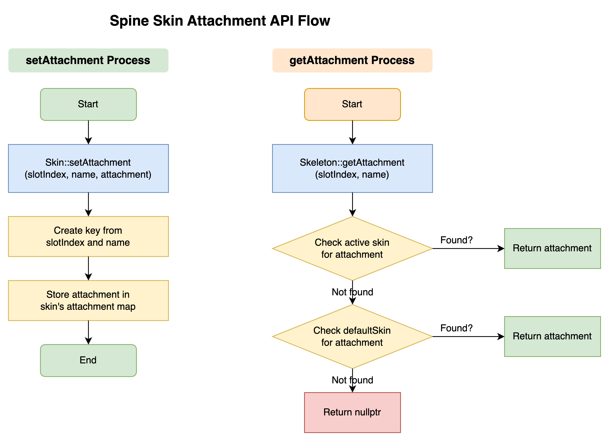
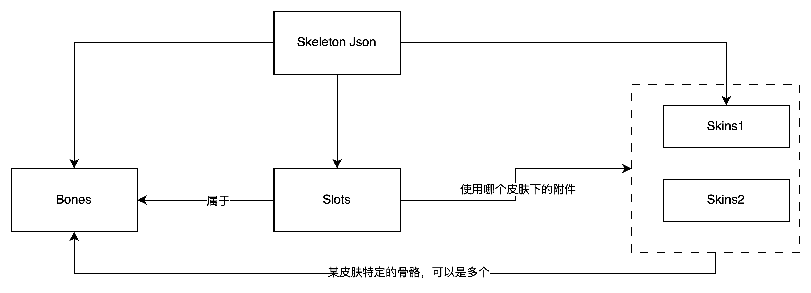
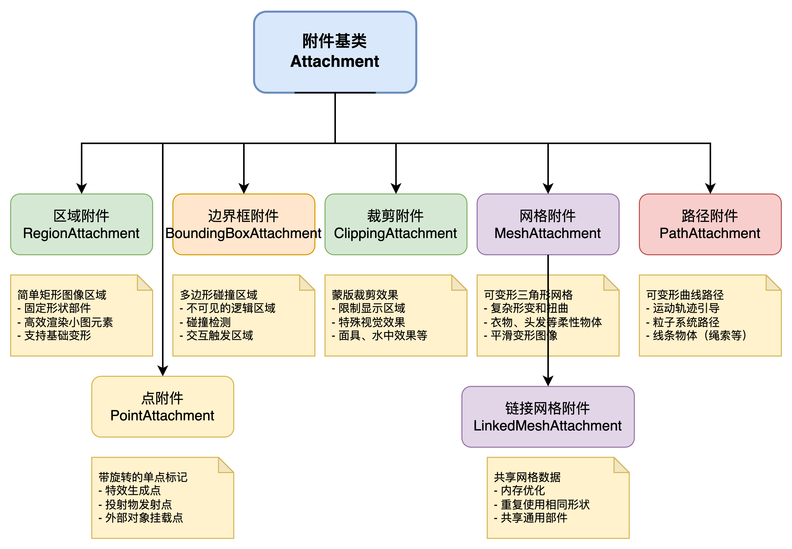

## 引言
这是一篇关于 SpineRuntime 中 Skins 实现的分析文章，主要分析 SpineRuntime 中 Skins 的实现方式和使用方法。

spine rumtimes 是一个用于在游戏中渲染 Spine 动画的库，支持多种平台和语言，包括 C++、C#、Java 和 JavaScript 等。本文主要分析 C++ 版本的实现，聚焦于 skins 的实现，分析最佳实践以及如何实现的换肤功能。

github 官方地址：[spine-runtimes](https://github.com/EsotericSoftware/spine-runtimes)

## 1. Skins 的实现方式
皮肤本质上是按插槽索引和附件名称组织的附件集合，每个 Skin 持有若干附件（Attachment），这些附件对应 Spine 编辑器中某皮肤下各插槽的具体图像或网格等资源，还可以包含仅在**该皮肤激活时才启用的骨骼和约束**

### 1.1 Skin 的数据结构
根据 Spine Runtimes 官方文档，Skin 具有如下重要属性：
- 名称：每个 Skin 有唯一的名称标识
- 附件集合：按插槽索引和附件名称索引的附件列表。可以将其理解为一个键值结构，其中键是 (slotIndex, attachmentName) 对，应对 Spine 编辑器中的“插槽-附件占位符”对应关系，值是实际的 Attachment 对象。
- 皮肤骨骼列表（Skin.bones）：包含所有属于该皮肤的骨骼引用 (API Reference - Spine Runtimes Guide)。这些骨骼仅在此皮肤激活时更新，平时被视为非活动状态，Spine 4.x 引入此特性以支持不同皮肤拥有各自附加的骨骼结构。

    > 这一特点可以用来实现一些特殊效果，比如激活某个特定的道具，如“翅膀”，在激活时将其附加到角色的骨骼上，而在不需要时将其移除。这样可以实现一些特殊的效果，比如角色在使用某个道具时，翅膀会随着角色的动作而移动，而在不使用时，翅膀会被隐藏。

- 皮肤约束列表（Skin.constraints）：包含所有属于该皮肤的约束（如 IK、Transform、Path 等）的引用 。类似皮肤骨骼，这些约束只有在皮肤激活时才随骨骼一起更新。
- 颜色属性：Skin 还保存了在编辑器中设置的皮肤颜色（如果有导出），该颜色可用于渲染时整体着色（此为非关键数据，在 JSON/Binary 导出为非必须项）。

编辑器导出数据时会将未属于任何皮肤的附件归入到“默认皮肤”中，默认皮肤是一个特殊的皮肤，包含所有未分配到其他皮肤的附件。它在运行时被视为一个空皮肤，不能被激活或禁用。默认皮肤的存在是为了确保每个插槽都有一个默认的附件，即使在没有选择任何皮肤的情况下。

### 1.2 Skin::setAttachment（添加附件） 与 Skin::getAttachment（获取附件）
**添加附件（setAttachment）：** spine::Skin::setAttachment(int slotIndex, const String& name, Attachment* attachment) 将给定的 Attachment 加入皮肤，在该皮肤的附件映射中登记到指定插槽索引和附件名称下。

**获取附件（getAttachment）：** spine::Skin::getAttachment(int slotIndex, const String& name) 按插槽和名称查询并返回对应的 Attachment 对象指针。如果皮肤中不存在该附件则返回空指针。

通常，不直接调用 Skin 自身的 getAttachment 来取附件，而是通过 Skeleton 提供的接口（Skeleton::getAttachment）来获取，这样可以自动考虑默认皮肤的后备，优先从当前皮肤查找附件名，找不到则尝试 SkeletonData 的 defaultSkin，从中获取附件。

除了单个附件查询，Spine 3.8+ 还为 Skin 添加了批量获取和合并的API，例如 getAttachments() 可获取皮肤的全部附件列表，addSkin(Skin other) 可以把另一个皮肤的所有附件、骨骼和约束合并到当前皮肤。而 copySkin(Skin other) 则会复制附件（深拷贝大部分附件，网格Mesh类型采用共享父网格的链式复制）。

## 2. Skins 与 Slots 的关联

### 2.1 附件类型

### 2.2 换肤对动画及插槽的影响
slot 是换肤执行的载体，setSkin 通过更新 Slot 的 attachment 实现换肤。

## 生成皮肤缩略图
在UI上显示各皮肤的缩略图供选择。实现思路是：遍历 SkeletonData 中所有可用皮肤，让 Skeleton 应用每个皮肤并渲染成图像

## 组合皮肤
可以将多个皮肤组合成一个新的皮肤，组合后的皮肤可以包含所有原始皮肤的附件、骨骼和约束。组合皮肤的实现方式是：遍历所有原始皮肤的附件、骨骼和约束，将它们添加到新的皮肤中。